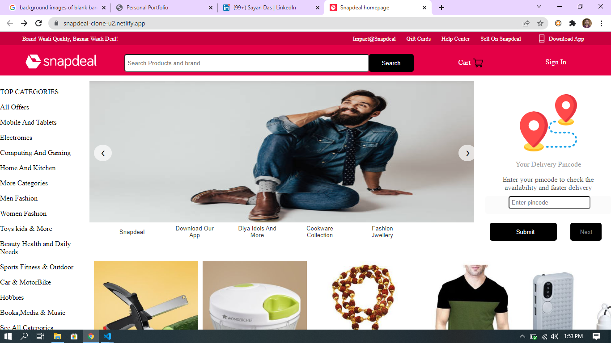
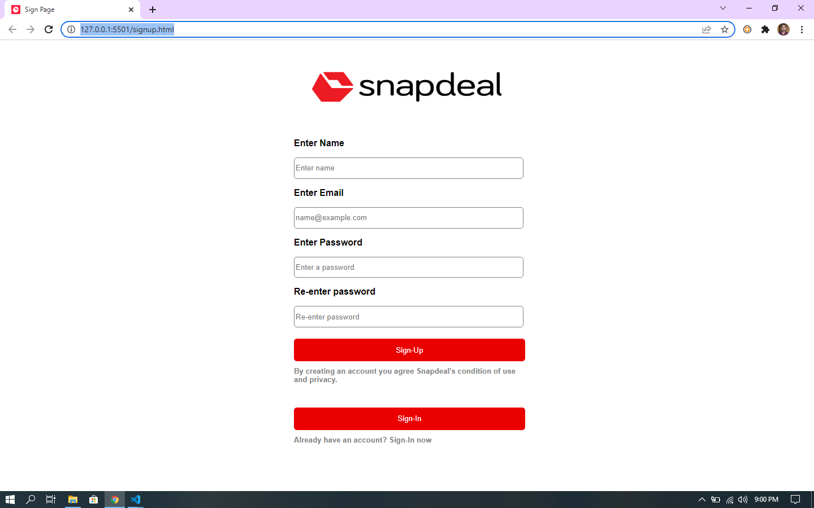
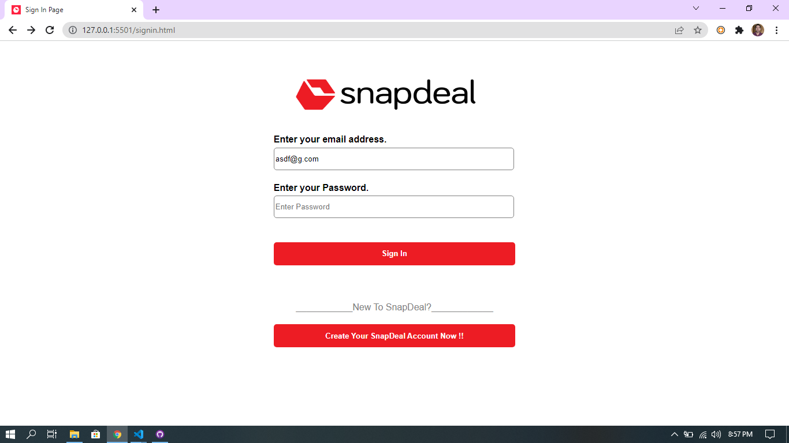
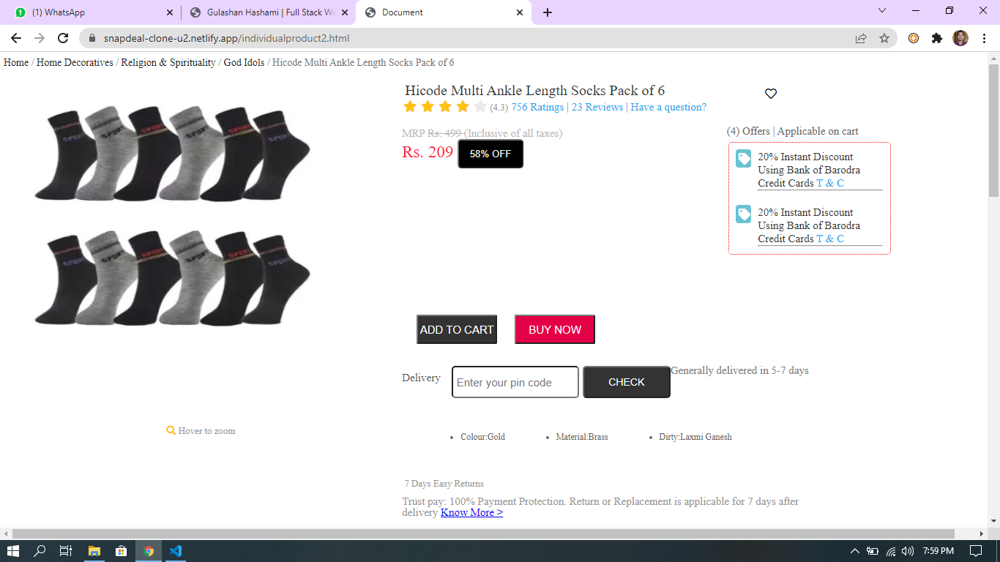
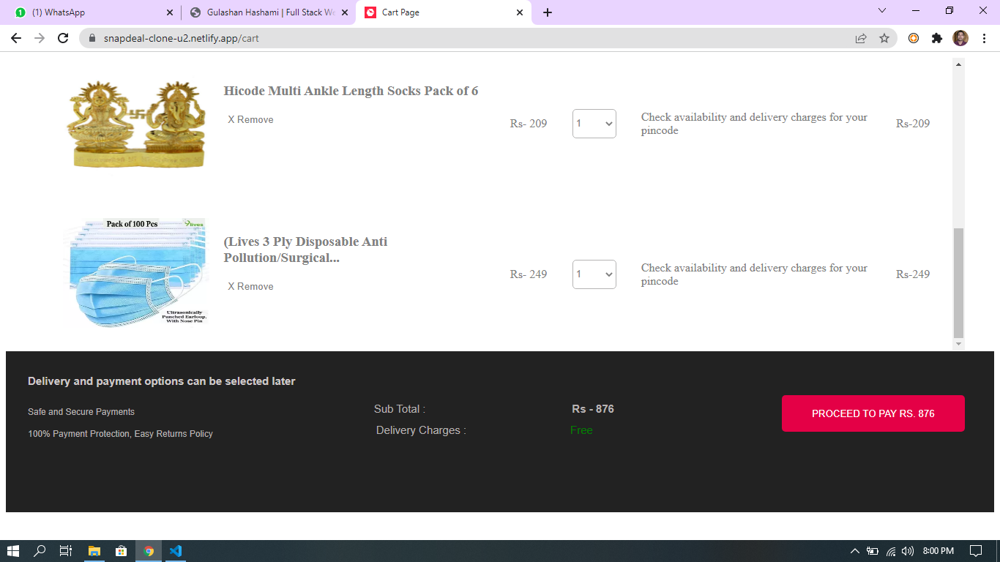
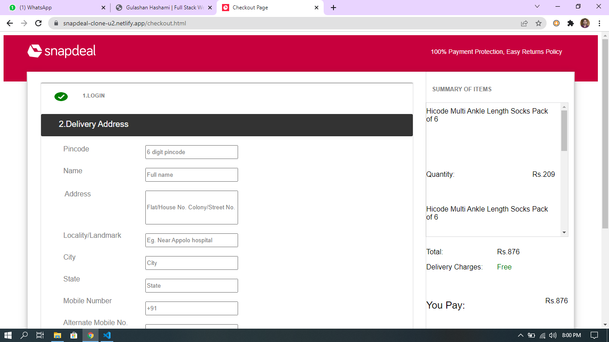
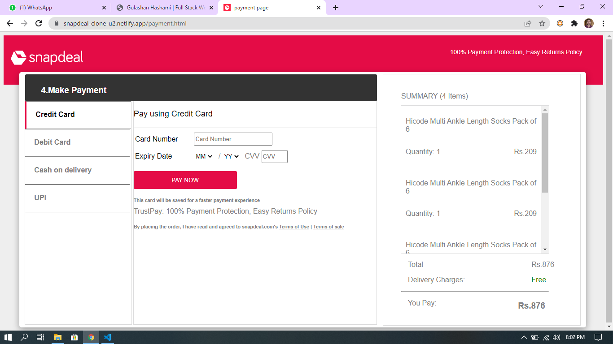

# Snapdeal-Clone

---

## Project Snapdeal is India's leading pure-play value Ecommerce platform, where we can buy any type of products. And sellers can sell their products.Week Unit-2

# Authors

- [Sayan Das ](https://github.com/sayanwastaken)
- [Ashutosh Swaraj ](https://github.com/ashutoshswaraj)
- [Shivshankar Vyankat Sagar](https://github.com/sagarshiv13)
- [Manish Kumar](https://github.com/manish7279)

# Prerequisities

- HTML
- JavaScipt
- DOM
- CSS

# Run Locally

- To run this project locally follow following steps below
- Create folder in your local system

Clone this Project

`git pull https://github.com/gulashanhashami/Snapdeal-Clone_Team36.git`

- Now the project is ready just go and visit home page

# Screenshots

> HOME PAGE

> SIGNUP PAGE

> LOGIN PAGE

> PRODUCT DETAILS PAGE

> CART PAGE

> CHECKOUT PAGE

> PAYMENT PAGE

# What did I Learn

- By end of this project, I am able to learn how effective work can be done as a team when ideas are trajected in multiple spectrums.

- The coordination while presenting the project was a new experience for all the members of the team which was fun driven as well as professional learning.

- Effective learning involves how we were able to suggest constructive feedback on each other’s work and debug before we present our project.
